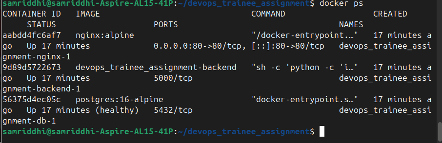
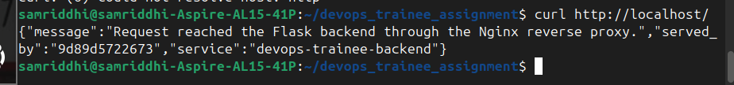
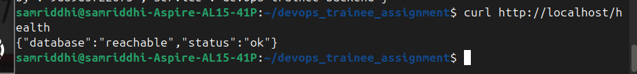
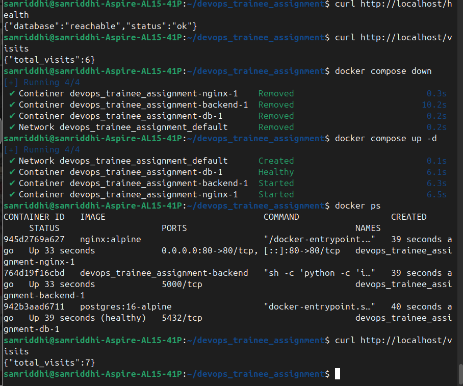

# IT Infrastructure & DevOps Practical Assignment

## Task 1: System Provisioning & Linux Administration

### Objective

Provision an Ubuntu environment and apply basic Linux security hardening.

### Configuration completed

* Created a dedicated `trainee` user.
* Granted the `trainee` user sudo privileges.
* Disabled direct SSH root login.
* Configured SSH to listen on port `2222` instead of the default port `22`.
* Configured SSH key-based authentication.
* Disabled password-based SSH authentication.
* Enabled UFW firewall.
* Configured UFW to allow only:

  * SSH: `2222/tcp`
  * HTTP: `80/tcp`
  * HTTPS: `443/tcp`

### Verification

Check the firewall configuration:

```bash
sudo ufw status verbose
```

Check SSH security configuration:

```bash
sudo sshd -T | grep -E '^(port|permitrootlogin|pubkeyauthentication|passwordauthentication)'
```

Check the SSH listening port:

```bash
sudo ss -tlnp | grep ssh
```

### Expected SSH configuration

The SSH configuration should show:

```text
port 2222
permitrootlogin no
pubkeyauthentication yes
passwordauthentication no
```

SSH should be listening on port `2222`.

### Evidence

#### UFW firewall


#### SSH hardening


#### Trainee sudo privileges


## Task 2: Containerization & Web Services

### Objective

Containerize a Flask backend application with PostgreSQL and expose the application through an Nginx reverse proxy using Docker Compose.

### Architecture

The application consists of three Docker services:

* **Nginx** — public-facing reverse proxy listening on host port `80`.
* **Flask Backend** — application service listening internally on port `5000`.
* **PostgreSQL** — database service using a persistent Docker volume.

The services communicate through the Docker Compose network. The backend and PostgreSQL database are not directly exposed to the host.

### Services and Networking

| Service    | Image / Application  |              Port | Purpose                                   |
| ---------- | -------------------- | ----------------: | ----------------------------------------- |
| Nginx      | `nginx:alpine`       |              `80` | Reverse proxy and public HTTP entry point |
| Backend    | Flask application    | `5000` (internal) | Handles application requests              |
| PostgreSQL | `postgres:16-alpine` | `5432` (internal) | Persistent application database           |

Nginx forwards incoming HTTP requests to the Flask backend. The backend communicates with PostgreSQL through the internal Docker network.

### Nginx Reverse Proxy

Nginx is configured as the public entry point for the application. Requests sent to:

```text
http://localhost/
```

are forwarded to the Flask backend.

The reverse-proxy configuration was verified with:

```bash
curl http://localhost/
```

Expected response:

```json
{
  "message": "Request reached the Flask backend through the Nginx reverse proxy.",
  "served_by": "<backend-container-id>",
  "service": "devops-trainee-backend"
}
```

### Database Health

The backend provides a health endpoint that verifies connectivity to PostgreSQL:

```bash
curl http://localhost/health
```

Expected response:

```json
{
  "database": "reachable",
  "status": "ok"
}
```

### Database Persistence

The application includes a visit counter stored in PostgreSQL:

```bash
curl http://localhost/visits
```

Persistence was verified by recording the visit count, stopping the Docker Compose stack, starting it again, and checking the count after restart.

The test was performed with:

```bash
docker compose down
docker compose up -d
docker ps
curl http://localhost/visits
```

The PostgreSQL data remained available after the containers were recreated. For example, the visit count increased from `3` before the restart to `4` after the restart, and a later restart confirmed the count continuing to `7`.

The PostgreSQL volume was preserved by **not** using:

```bash
docker compose down -v
```

### Verification

Check the running containers:

```bash
docker ps
```

The expected stack contains:

* Nginx container with host port `80` mapped to container port `80`.
* Flask backend container with internal port `5000`.
* PostgreSQL container showing `healthy` status.

Verify the reverse proxy:

```bash
curl http://localhost/
```

Verify database connectivity:

```bash
curl http://localhost/health
```

Verify database persistence:

```bash
curl http://localhost/visits
```

### Evidence

#### Docker containers

The Docker Compose stack is running with Nginx, the Flask backend, and PostgreSQL. PostgreSQL reports a healthy status.



#### Nginx reverse proxy

The response confirms that the request reaches the Flask backend through the Nginx reverse proxy.



#### Database health

The health endpoint confirms that the Flask backend can successfully reach PostgreSQL.



#### Database persistence

The visit counter remains persistent after stopping and recreating the Docker Compose containers, demonstrating that PostgreSQL data is stored in a persistent Docker volume.


