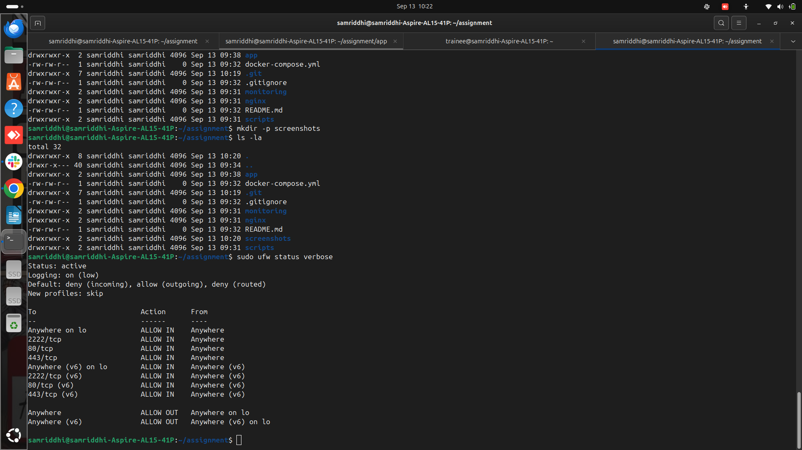
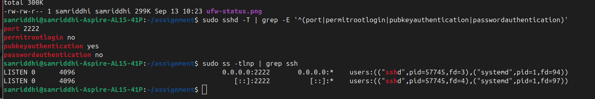
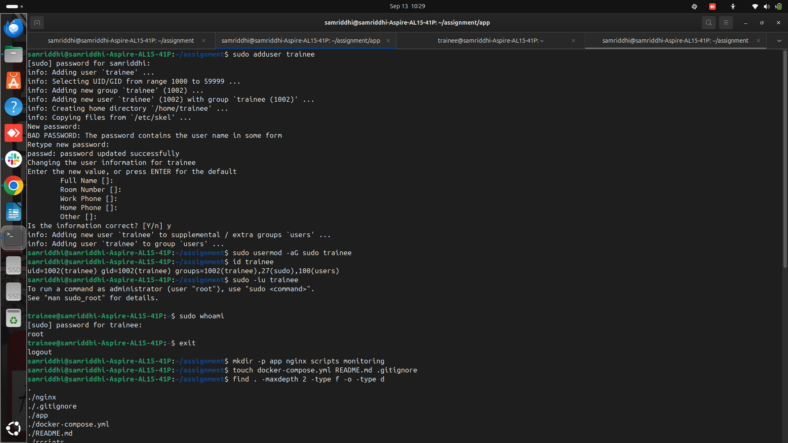

# IT Infrastructure & DevOps Practical Assignment

## Task 1: System Provisioning & Linux Administration

### Objective

Provision an Ubuntu environment and apply basic Linux security hardening.

### Configuration completed

* Created a dedicated `trainee` user.
* Granted the `trainee` user sudo privileges.
* Disabled direct SSH root login.
* Configured SSH to listen on port `2222` instead of the default port `22`.
* Configured SSH key-based authentication.
* Disabled password-based SSH authentication.
* Enabled UFW firewall.
* Configured UFW to allow only:

  * SSH: `2222/tcp`
  * HTTP: `80/tcp`
  * HTTPS: `443/tcp`

### Verification

Check the firewall configuration:

```bash
sudo ufw status verbose
```

Check SSH security configuration:

```bash
sudo sshd -T | grep -E '^(port|permitrootlogin|pubkeyauthentication|passwordauthentication)'
```

Check the SSH listening port:

```bash
sudo ss -tlnp | grep ssh
```

### Expected SSH configuration

The SSH configuration should show:

```text
port 2222
permitrootlogin no
pubkeyauthentication yes
passwordauthentication no
```

SSH should be listening on port `2222`.

### Evidence

#### UFW firewall



#### SSH hardening



#### Trainee sudo privileges


